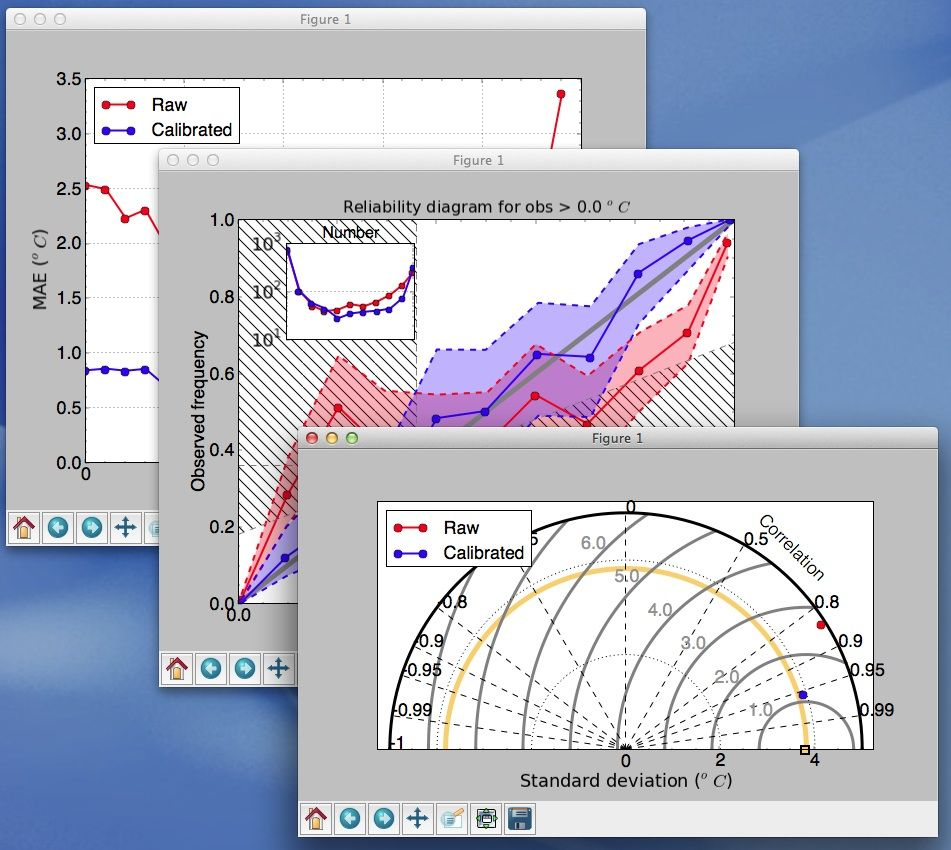

Forecast verification software
==============================

.. image:: https://travis-ci.org/WFRT/verif.svg?branch=master
  :target: https://travis-ci.org/WFRT/verif
.. image:: https://coveralls.io/repos/WFRT/verif/badge.svg?branch=master&service=github
  :target: https://coveralls.io/github/WFRT/verif?branch=master

``verif`` is a command-line tool that lets you verify the quality of weather forecasts for point
locations. It can also compare forecasts from different forecasting systems (that have different
models, post-processing methods, etc).

The program reads files with observations and forecasts in a specific format (see "Input files"
below). The input files contain information about dates, forecast lead times, and locations such
that statistics can be aggregated across different dimensions. To ensure a fair comparison among
files, ``verif`` will discard data points where one or more forecast systems have missing forecasts.
Since ``verif`` is a command-line tool, it can be used in scripts to automatically create
verification figures.

A prototype version has been released (see "Installation Instruction" below). We welcome suggestions
for improvements. ``verif`` is developed by Thomas Nipen, David Siuta, and Tim Chui.

Features
--------

* Deterministic metrics such as MAE, bias, correlation, RMSE (e.g. ``-m mae``)
* Threshold-based metrics such as the false alarm rate, ETS, EDI, Yule's Q (e.g. ``-m ets``)
* Probabilistic metrics such as brier score, PIT-histogram, reliability diagrams (e.g. ``-m bs``)
* Special plots like Taylor diagrams (``-m taylor``), quantile-quantile plots (``-m qq``).
* Plot scores as a function of date, lead time, station elevation/lat/longitude (e.g. ``-x date``)
* Show scores on maps (``-type map``)
* Subset the data by specifying a date range and lat/lon range (``-llrange 5,10,58 60``)
* Export to text (``-type text``)
* Options to adjust font sizes, label positions, tick marks, legends, etc (``-labfs 14``)
* Anomaly statistics relative to a baseline like climatology (``-c climfile.txt``)
* Output to png, jpeg, eps, etc and specify dimensions and resolution (``-f image.png -dpi 300``)

For a full list, run ``verif`` without arguments.

Installation Instructions
-------------------------

Download the source code of the latest version: https://github.com/WFRT/verif/releases/. Unzip
the file and navigate into the extracted folder. ``verif`` requires python as well as the python
packages numpy, scipy, and matplotlib. The python package basemap is optional, but provide a
background map when verification scores are plotted on a map. NetCDF4/HDF5 is not required, but will make
reading of NetCDF files faster. If this package is not found, the NetCDF capabilities from scipy will
be used instead.

**Ubuntu**

Install the required pacakges:

.. code-block:: bash

  sudo apt-get install python-numpy python-scipy python-matplotlib python-setuptools

Then install ``verif`` by executing the following inside the extracted folder:

.. code-block:: bash

  sudo python setup.py install

This will create the executable ``/usr/local/bin/verif``.  Add this to your PATH environment
variable if necessary (i.e add ``export PATH=/usr/local/bin/:$PATH`` to ``~/.bashrc``). If you do
not have sudo privileges do:

.. code-block:: bash

  sudo python setup.py install --user

This will create the executable ``~/.local/bin/verif``. Add the folder to your PATH environment
variable.

**Mac OSX**

Install python, numpy, scipy, and matplotlib, then install ``verif`` by executing the following
inside the extracted folder:

.. code-block:: bash

  sudo python setup.py install

``verif`` will then be installed ``/usr/local/share/python/`` or where ever your python modules are
installed (Look for "Installing verif script to <some directory>" when installing). Add the folder
to your PATH environment variable.

Examples
--------
Fake data for testing the program is found in ``./examples/``. There is one "raw" forecast file and
one bias-corrected forecast file (where a Kalman filter has been applied). Here are some example
commands to test out:

.. code-block:: bash

   verif examples/raw.txt examples/kf.txt -m mae
   verif examples/raw.txt examples/kf.txt -m ets
   verif examples/raw.txt examples/kf.txt -m taylor
   verif examples/raw.txt examples/kf.txt -m error
   verif examples/raw.txt examples/kf.txt -m reliability -r 0
   verif examples/raw.txt examples/kf.txt -m pithist

Text-based input
----------------
To verify your own forecasts, the easiest option is to put the data into the following format:

.. code-block:: bash

   # variable: Temperature
   # units: $^oC$
   date     offset id      lat     lon      elev     obs      fcst   p10
   20150101 0      214     49.2    -122.1   92       3.4      2.1    0.914
   20150101 1      214     49.2    -122.1   92       4.7      4.2    0.858
   20150101 0      180     50.3    -120.3   150      0.2      -1.2   0.992

Any lines starting with '#' can be metadata (currently variable: and units: are recognized). After
that is a header line that must describe the data columns below. The following attributes are
recognized:
 * date (in YYYYMMDD)
 * offset (forecast lead time in hours)
 * id (station identifier)
 * lat (in degrees)
 * lon (in degrees)
 * obs (observations)
 * fcst (deterministic forecast)
 * p<number> (cumulative probability at a threshold of 10)
obs and fcst are the only required columns. Note that the file will likely have many rows with repeated values of offsetid/lat/lon/elev. If station and lead time information is missing, then ``verif`` assumes they are all for the same station and lead time. The columns can be in any order.

Deterministic forecasts will only have "obs" and "fcst", however probabilistic forecasts can provide
any number of cumulative probabilities. For probabilistic forecasts, "fcst" could represent the
ensemble mean (or any other method to reduce the ensemble to a deterministic forecast).

Available metrics
-----------------
Here is a list of currently supported metrics. Note that the plots that are possible to make depend
on what variables are available in the input files.

======================  ===============================================================
**Deterministic**       **Description**
----------------------  ---------------------------------------------------------------
``-m alphaindex``       Alpha index
``-m bias``             Mean error
``-m cmae``             Cube-root mean absolute cubic error
``-m corr``             Pearson correlation between obs and forecast
``-m crmse``            Centered root mean squared error
``-m droc``             receiver operating characteristic for deterministic forecast
``-m dmb``              Degree of mass balance (mean obs / mean fcst)
``-m ef``               Exceedance fraction: fraction that fcst > obs
``-m fcst``             Average forecast value
``-m kendallcorr``      Kendall correlation
``-m mae``              Mean of forecasts
``-m nsec``             Nash-Sutcliffe efficiency coefficient
``-m num``              Number of valid forecasts
``-m obs``              Mean of observations
``-m qq``               Quantile-quantile plot
``-m rankcorr``         Spearman rank correlation
``-m rmse``             Root mean squared error
``-m rmsf``             Root mean squared factor
``-m stderror``         Standard error
``-m within``           Percentage of forecasts that are within some error bound
----------------------  ---------------------------------------------------------------
**Threshold**           **Description**
----------------------  ---------------------------------------------------------------
``-m baserate``         Climatological frequency
``-m biasfreq``         Numer of forecasts / number of observations
``-m count``            Number of forecasts wabove a threshold
``-m diff``             Difference between false alarms and misses
``-m dscore``           Generalized discrimination score
``-m edi``              Extremal dependency index
``-m eds``              Extreme dependency score
``-m ets``              Equitable threat score
``-m fa``               False alarm rate
``-m far``              False alarm ratio
``-m hit``              Hit rate
``-m hss``              Heidke skill score
``-m kss``              Hanssen-Kuiper skill score
``-m lor``              Log odds ratio
``-m miss``             Miss rate
``-m or``               Odds ratio
``-m pc``               Proportions correct
``-m performance``      Diagram showing POD, FAR, bias, and threat score
``-m quantilescore``    Quantile score
``-m sedi``             Symmetric extremal dependency index
``-m seds``             Symmetric extreme dependency score
``-m threat``           Threat score
``-m yulesq``           Yule's Q (odds ratio skill score)
----------------------  ---------------------------------------------------------------
**Probabilistic**       **Description**
----------------------  ---------------------------------------------------------------
``-m bs``               Brier score
``-m bsrel``            Reliability component of Brier score
``-m bsres``            Resolution component of Brier score
``-m bss``              Brier skill score
``-m bsres``            Uncertainty component of Brier score
``-m discrimination``   Discrimination diagram for a specified threshold
``-m economicvalue``    Economic value for a specified threshold
``-m invreliability``   Reliability diagram for a specified quantile
``-m leps``             Linear error in probability space
``-m marginal``         Marginal distribution for a specified threshold
``-m marginalratio``    Ratio of marginal probability of obs to that of fcst
``-m pitdev``           Deviation of the PIT histogram
``-m pithist``          Histogram of PIT values
``-m reliability``      Reliability diagram for a specified threshold
``-m roc``              Receiver operating characteristics plot for a specified threshold
``-m spherical``        Pherical probabilistic scoring rule
----------------------  ---------------------------------------------------------------
**Special plots**       **Description**
----------------------  ---------------------------------------------------------------
``-m against``          Plots the determinstic forecasts from each file against each other
``-m cond``             Plots forecasts as a function of obs
``-m error``            Decomposition of RMSE into systematic and unsystematic components
``-m freq``             Show frequency distribution of obs and fcst
``-m meteo``            Show forecasts and obs in a meteogram
``-m obsfcst``          A plot showing both obs and fcst
``-m scatter``          A scatter plt of obs and fcst
``-m spreadskill``      Plots forecast spread vs forecast skilL
``-m spreadskilldiff``  Difference between spread and skill
``-m taylor``           Taylor diagram showing correlation and fcst stdev
``-m timeseries``       Time series of obs and forecasts
======================  ===============================================================

Proposed NetCDF input
---------------------
We are working on defining a NetCDF format that can also be read by ``verif``. Here is our current
proposal, based on the NetCDF/CF standard:

.. code-block:: bash

   netcdf format {
   dimensions :
      date    = UNLIMITED;
      offset  = 48;
      station = 10;
      ensemble = 21;
      threshold = 11;
      quantile = 11;
   variables:
      int id(station);
      int offset(offset);
      int date(date);
      float threshold(threshold);
      float quantile(quantile);
      float lat(station);
      float lon(station);
      float elev(station);
      float obs(date, offset, station);              // Observations
      float ens(date, offset, ensemble, station);    // Ensemble forecast
      float fcst(date, offset, station);             // Deterministic forecast
      float cdf(date, offset, threshold, station);   // Accumulated prob at threshold
      float pdf(date, offset, threshold, station);   // Pdf at threshold
      float x(date, offset, quantile, station);      // Threshold corresponding to quantile
      float pit(date, offset, station);              // CDF for threshold=observation

   global attributes:
      : name = "raw";                                // Used as configuration name
      : long_name = "Temperature";                   // Used to label plots
      : standard_name = "air_temperature_2m";
      : Units = "^oC";                               // Used to label axes
      : Conventions = "verif_1.0.0";
      }

Copyright and license
---------------------

Copyright © 2015-2016 UBC Weather Forecast Research Team. ``verif`` is licensed under the 3-clause
BSD license. See LICENSE file.
